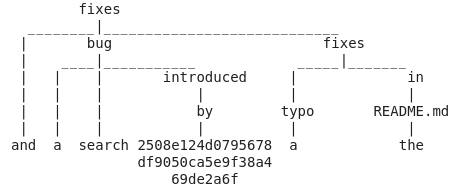

# Bugfix Commits miner

`bugfix-commits-miner` is a Python script for the extraction of bug-fixing commits that reference the corresponding bug-introducing commit. It mines data from GitHub Archive.
There are two working modes, multi (parallel) and single container. All the extracted data will be stored in a MySQL database.

This script was used in the ICSE'21 paper "Evaluating SZZ Implementations Through a Developer-informed Oracle". For more information, please check out the [preprint](https://arxiv.org/abs/2102.03300) and the [replication package](https://github.com/grosa1/icse2021-szz-replication-package).

## Usage

The `docker-compose` command is used with the configuration file `docker-compose.yml` to run the worker containers and the DB container.

**Requirements:**

* Docker
* docker-compose
* python3

**Files info:**

* `docker-compose.yml_bak` contains the single-run configuration.
* `gen_compose.py` creates docker-compose.yml for multi-run configuration.
* `run.sh` builds the worker images, then runs the docker-compose generator and at last runs the `docker-compose` command.

### Setup:

Please replace all the `<PLACEHOLDER>` with the correct DB credentials to use.

### Multi-container run:

In multi-container execution, the input archives are divided by a defined number of workers. With the `run.sh` script, a `docker-compose.yaml` file with the configuration to execute will be generated using `gen_compose.py`:

 1. `run.sh <full/path/to/data/dir> <num of workers>`
 
the same can be achieved by running:

 1. `docker build -t szz_commits_worker src/.`
 2. `python3 gen_compose.py <full/path/to/data/dir> <num of workers>`
 3. `docker-compose up -d`
 

### Single container run:

In single container execution, there is a default configuration saved in `docker-compose.yml_bak`, where you have to set the path of the directory that contains the data *(replace ./data with full/path/to/data/dir)*:

 1. `cp docker-compose.yml_bak docker-compose.yml`
 2. `docker-compose up -d`

 ## How does it work?

The miner simply makes a 2-level check on the commit message. First, it checks if the message matches the following pattern:

 `NOT <Merge> AND <fix OR solve> AND <bug OR issue OR problem OR error OR misfeature>`

The miner then applies heuristics based on regex and dependency parsing using the `spaCy` library. After the extraction of the bug introducing commit hash, there is a first check for duplicate commits by hash, message and buggy commit id. Next, the miner uses PyDriller for extracting data related to the buggy commit. As a final step, it saves everything in the database, making a second check on the duplicates first.

In the database, there will be two types of fix commits: those containing `" introd"` keyword and those without, where `filter_introd` field indicates whether the filter has been used (1) or not used (0).

### Stopwords:

There are two sets of stopwrods that are used:

1. `introd_stopwords`: for commit messages with sub-string `" introd"`:
 
`['attempt', 'test']`

2. `fix_stopwords`, for commit messages without sub-string `" introd"`:

 `['was', 'been', 'attempt', 'seem', 'solved', 'fixed', 'try', 'trie', 'by', 'test']`
 
### Heuristics:

The heuristics based on regex and `spaCy` works as follows:

1. Split the commit message into *sentences*.
2. For each *word token* in each *sentence*, apply the following filters:
    * the *word token* is a **commit hash**;
    * there are no other **commit hash** in ancestors;
    * the *sentence* must not start with the **commit hash**;
    * the word **revert** must not be in the *sentence*.
3. Apply `spaCy` dependency parsing to the previously selected **commit hash** token.
4. Save the **commit hash** only if it has one of the following word dependency constraints:
    1. if in hash ancestors there is the sub-string `" introd"` (`filter_introd = 1`):
        * there must be both a **fix keyword** and a **bug keyword** in commit hash ancestors, then there must be none of the `introd_stopwords`;
        * there must be at least the **fix keyword** in hash ancestors, then in its dependencies (children and ancestors) there must be a **bug keyword** and none of the `introd_stopwords`;
        * there must be at least the **bug keyword** in hash ancestors, then in its dependencies (children and ancestors) there must be a **fix keyword**;
    2. otherwise (`filter_introd = 0`):
        * there must be both a **fix keyword** and a **bug keyword** in commit hash ancestors, then there must be none of the `fix_stopwords` in hash ancestors and **fix keyword** dependencies (children and ancestors).
5. It returns the **commit hash** as the *bug introducing commit hash* if no other **commit hash** has been saved.

### Dependency parsing example:

For example, we have the following sentence:

*fixes a search bug introduced by 2508e124d0795678df9050ca5e9f38a469de2a6f and fixes a typo in the README.md*

The word dependency tree will be as follows:



### Log parsing

| Name                                       |   `grep` pattern             |
|--------------------------------------------|------------------------------|
| Duplicates                                 | "INFO :: skip duplicate:"    |
| Total processed commits count              | "INFO :: total processed commits:" |
| Commits stored in db                       | "INFO :: stored:"            |
| Exceptions (mainly for missing commit hash)| "ERROR :: exception:"        |

## How to cite
```
@inproceedings{rosa2021evaluating,
  title={Evaluating SZZ Implementations Through a Developer-informed Oracle},
  author={Rosa, Giovanni and Pascarella, Luca and Scalabrino, Simone and Tufano, Rosalia and Bavota, Gabriele and Lanza, Michele and Oliveto, Rocco},
  booktitle={2021 IEEE/ACM 43rd International Conference on Software Engineering (ICSE)},
  pages={436--447},
  year={2021},
  organization={IEEE}
}
```